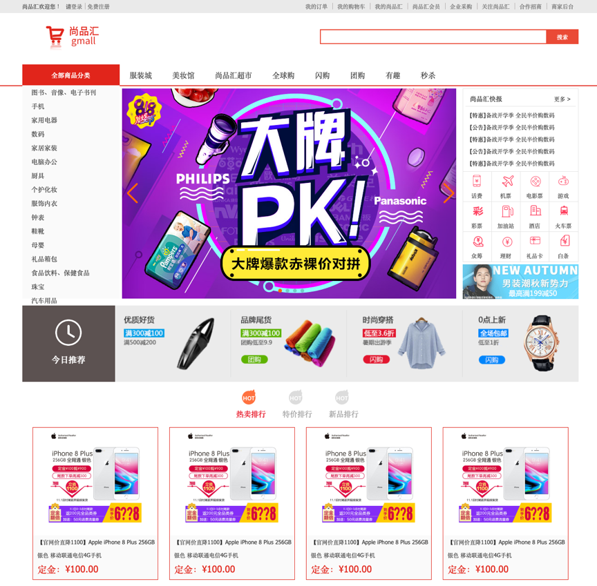
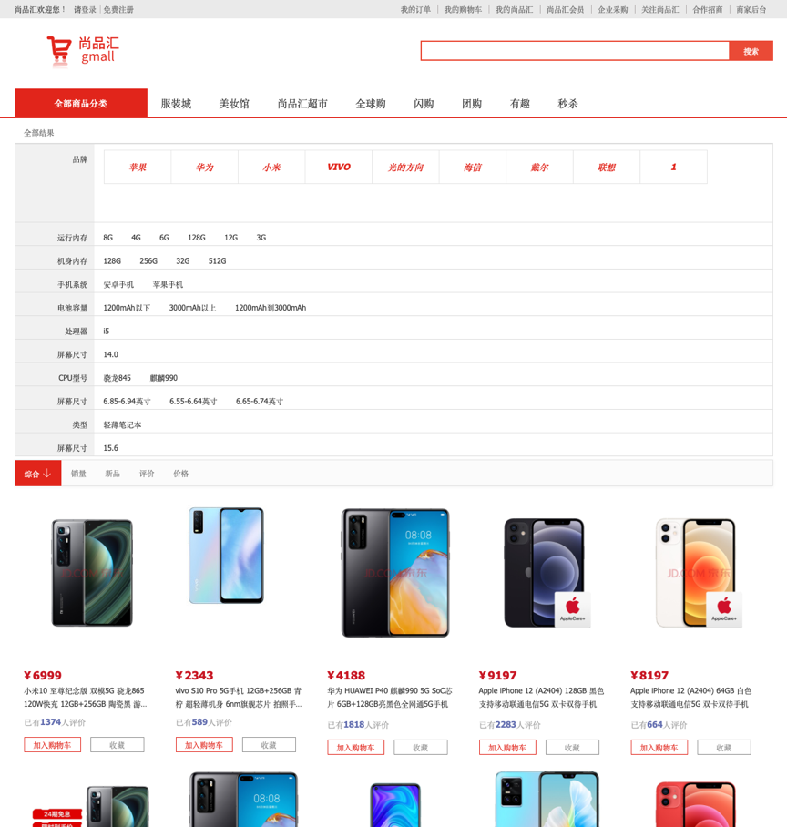
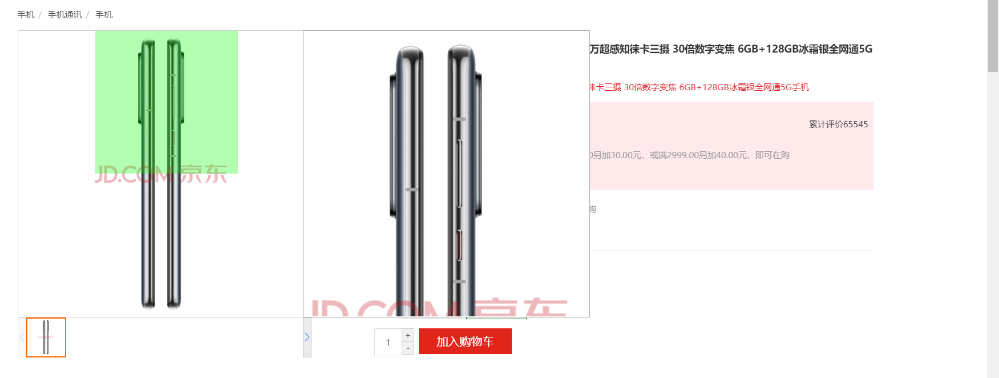
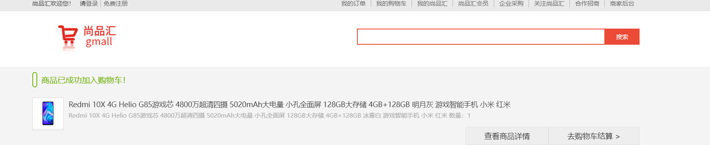
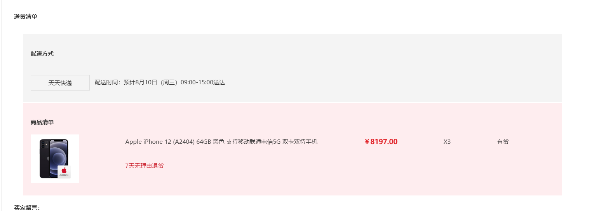
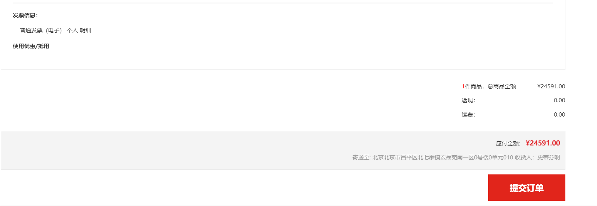
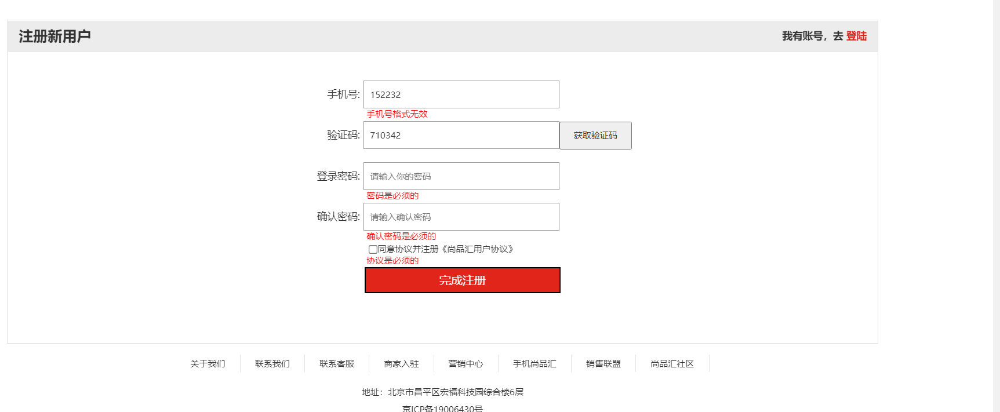
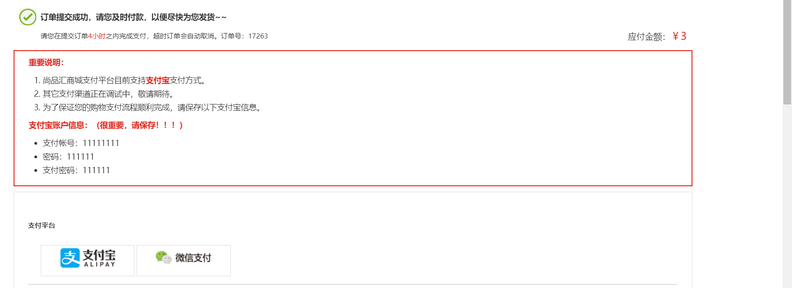
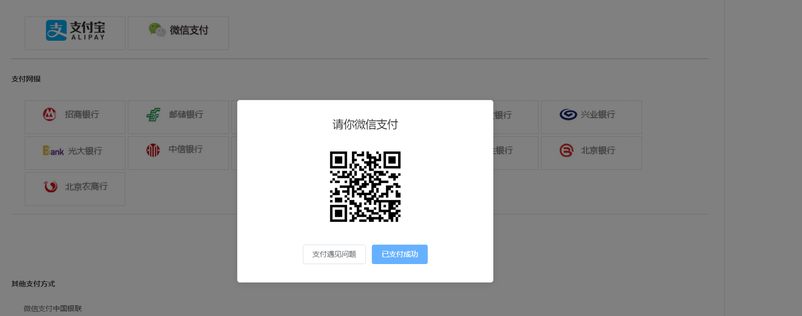

This project is an online e-commerce web app (SPA).
It includes multiple sub-modules such as home page, search list, product details, shopping cart, orders, payment, user login/registration, etc.
The latest and most popular front-end technologies such as Vue.js, ES6+, and Axios are used.
The development approach follows a modular, component-based, and engineering pattern. Assisted in the development of internal tools and systems to improve team efficiency and productivity.

## Project setup

## 1. npm install

## 2.npm run start
Runs the app and open it to view in the browser.

Home page:

Search page:

Understanding and preparation of search query parameters

Dynamically display component data

Search by category and keyword

Search by brand

Search by attribute

Sorting search results

Custom pagination component

Detail page:

Image zoom effect

Small image carousel

AddCartSuccess page:

checkout page:

Handling of temporary user IDs

Management of shopping cart data (complex)

Not using v-model to monitor user input

Use of async/await/Promise.all()

Sign-up page:

Handling of component response after registration/login request

Automatic carrying of token data after login

Test account and password:

Account: 13700000000 Password: 111111

Sign-in page:

Submit order:

Payment QR code

Get order status

Payment component

Lazy loading of images:

Display a loading image when the target image is not loaded yet, and load the target image only when it enters the visible range.

Lazy loading of routes:

(1) When building the application, the JS package becomes very large, which affects the loading of the page. If we can split the components corresponding to different routes into different code blocks and load the corresponding components only when the route is accessed, it will be more efficient.
(2) Essentially, it is the application of Vue's asynchronous components to route components. The dynamic import syntax is required, which is the import() function.

Front-end form validation:

(1) In the project, some forms such as registration/login forms need to be validated before submitting the request.
(2) Only when the front-end form validation is successful will the request be sent.
(3) If the validation fails, it will be displayed in the form of red text on the interface, rather than using alert.
(4) In addition to clicking the submit button, validation is also performed in real time during input.

